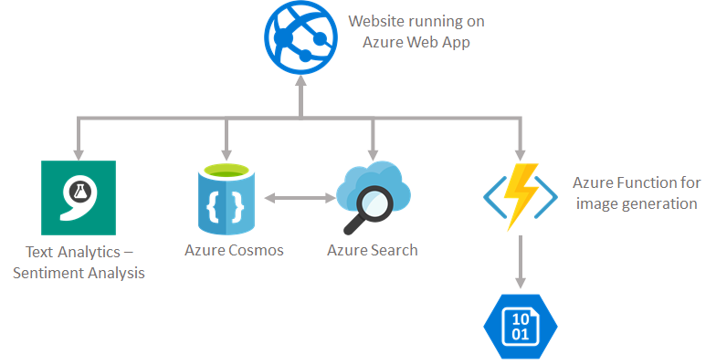

## Demo of Azure Services

This repository will give you a starting application and a finished application that you can leverage to demonstrate the following Azure services:

*   Azure App Service
*   Azure Cosmos (MongoDb connector)
*   Azure Search
*   Microsoft Cognitive Services - Text Analytics API
*   Azure Functions

The intent of this demo is to show how easy it is to take a relatively ordinary application and enhance it using these services. Through a combination of spinning up the services in Azure and also inserting some simple code snippets you can walk through the journey yourself and show others as well.

The app is a simple concept. It shows a random motivational quote when you visit the page. You can add more quotes via a simple form which will then get added to the database.

The technology stack is:

*   Node JS using Express Framework
*   Mongo DB

Throughout the course of this we will add various functionality including adding search capabilities, intelligence as well as backend processing. The final application architecture will be like this



### Step 1 - Running locally
To get the app running locally:
1.  Clone this repository and navigate into _app-original_ folder.
2. Create a Mongo database (either locally or you can spin one up for free on MongoLabs).
3. Update the connection string setting in server.js to point to your mongo database.
    ```
    app.set('dbconn', '<mongodb-connection-string');
    ```
4. At the root level of app-original, run _npm install_ to install the node packages.
5. When complete, run `npm dev` to start the dev server
6. You should now be able to browse to the site. First step will be to load the quotes. To do this browse to http://localhost:5555/loadme. When done, browse to the home page and you should see a random quote.

### Step 2 - Deploy to Azure App Service

1. Log into the [Azure Portal](https://portal.azure.com)
2. Go to New -> Web & Mobile -> App service
3. Enter the required values and click create. This will create a web app and a service plan for you.
4. Once created, go to the web app and on the left menu choose Deployment options. From here, choose Local Git Repo.
5. From the Overview page of the web app you can grab the git url you will use to push your site to.
6. In the root of the app-original directory, from the console, type the following:
```
    git init
    git add .
    git commit -m "initial commit"
    git remote add azure <url for web app repo from #5 above>
    git push master azure
```
7. If this goes well, the code will be pushed to Azure App Service. When done, browse to your Azure Web App and you should see the site.

### Step 3 - Use Azure Cosmos

Previously known as Azure DocumentDb, Azure Cosmos is a multi model database. It also supports the native Mongo apis and so, since our app talks to Mongo today, we can leverage this to simply switch it to use Azure Cosmos with no changes to code.

1. In the Azure Portal, go to New->data stores->Azure Cosmos.
2. When created, simply grab the connection string.
3. Update server.js and change the MongoDb Connection string to the Azure Cosmos one. 
4. You can test this out locally. Don't forget to hit /loadme again since this a new database.

### Step 4 - Use Azure Search

So now we want to make our application a bit more exciting. Why not give users the ability to search for quotes. Azure has a built in search service called Azure Search which is really easy to use and very powerful.

1. Go to the Azure Portal and choose New -> Data -> Azure Search.
2. Create the search service.
3. Within the Search Service choose import data.
4. Choose the Azure Cosmos Db that the app is now pointing to
5. At this point it will sample the data and show you the fields it detects. You will want to select the options as so:
6. Click import
7. Let it run and at this point our index is now populated.
8. Now we have to modify our app to use this search service. To do this we will want to add a text search box. Modify index.ejs by adding the following snippet:
```
<form action="/quotes" method="POST">
	<div class="row justify-content-md-center">
		<div class="col-md-4 col-md-offset-4">
			<div class="form-group">
				<label for="code">Search</label>
				<input type="text" id="search" placeholder="search" name="name" class="form-control input-lg">
			</div>
		</div>
	</div>
</form>
```
9. We want the search box to show results as you type so we will add to index.ejs the following call to use jquery ui to do this:

```
<script>
$(function () {

	$("#search").autocomplete({
		select: function (e, ui) {
			$("#search").val(ui.item.label);
			return false;
		},

		source: function (request, response) {
			$.ajax({
				url: "search?q=" + request.term,
				data: request,
				success: function (data) {
					//var ParsedObject = $.parseJSON(data);
					response($.map(data, function (item) {
						return {
							label: item.quote + "-" + item.name,
							value: item.name
						};

					}))
				}
			});
		}
	});
});
</script>	
```

10. Now we need to create the calls to Azure Search in server.js. To do this we need to add a reference to the Azure Search node package.

```
var azureSearch = require('azure-search');
```

11. Next, initialize this with the Azure Search URL and key which you get from the service in Azure Portal

```
var searchClient = azureSearch({
    url: "https://jdhdemo.search.windows.net",
    key:"B52D232350FF8A2C235931971086D51A"
});
```

12. Finally, lets add the search route which my jquery autocomplete function will call.

```
app.get('/search', (req, res) => {
    var query = req.query.q;
    console.log(query);
      
     searchClient.search("quotes", {search: query}, function(err, results) {
                                                            console.log(results);
                                                            res.setHeader('Content-Type', 'application/json');
                                                            res.send(JSON.stringify(results));
                                                                       
                                                            if(err){
                                                                console.log("error  " + err);
                                                            }
                                                        });
})
```

### Step 5 - Add some intelligence
In this step we want to enhance our app and make it a bit more intelligent. Microsft offers a whole suite of apis that make it very easy to add intelligent capabilities to your applications very quickly. For our app, we allow users to add quotes. Since this is a motiviational application - we don't want quotes that are not positive. So, we can leverage the Text Analytics api to detect the sentiment of a quote and only accept those over a certain positivity threshold.

1. Create a cognitive services api via the Azure Portal. Go to New->Cognitive Services and choose the Text Analytics API.
2. When it is ready, grab the key for it.
3. We will now modify our quote page to call this service when a quote is submitted. In server.js add the following two settings:
```
app.set('cogsvcurl', 'https://westus.api.cognitive.microsoft.com/text/analytics/v2.0');
app.set('cogsvckey', '<cog-svc-key>');
```
4. Modify the quotes route to look like this:
```
app.post('/quotes', (req, res) => {
   
    var reqId = uuid.v4();

    request.post({
        url: app.get('cogsvcurl') + "/sentiment",
        headers: {
            "Content-Type": "application/json",
            "Ocp-Apim-Subscription-Key": app.get('cogsvckey')
        },
        json: true,
        body: {
            "documents": [
                {
                    "id": reqId,
                    "text": req.body.quote
                }
            ]
        }
    }, function (err, resp, body) {
        console.log("Response from Cog API (err, res, body)");
        console.log(JSON.stringify(err, null, " "));
        // Check to see if we succeeded.
        if (err || resp.statusCode != 200) {
            console.log(err);
        }
        
        if (body.documents[0].score < 0.6) {
            res.render('quotes.ejs', { msg: "That was not motivational enough!! Try again." })
        }
        else {
            db.collection('quotes').save(req.body, (err, result) => {
                if (err) return console.log(err)

                console.log('saved to database')
                res.redirect('/')
            })
        }
    });
})

```
5. Final step is to add a message box to the quotes.ejs page to report to the user if their quote was not allowed:
```
<div class="quotebox-text">
	<div class="row">

		<div class="col-md-10">
			<h1>
				<%= typeof msg!='undefined' ? msg : '' %>
			</h1>
		</div>
	</div>
```

### Step 7 - Leverage Azure Functions
The final addition to the app is to use an Azure Function to drive some processing to generate a meme and store that in a storage account. For meme generation I leverage imgflip and you need to create a free account there to leverage it also.

1. Create an Azure Function App via the Azure Portal
2. Choose http trigger and C#
3. In the function editor, under files create a folder call bin. Upload ImgFlip.dll to this bin folder.
4. Under integrate, add an output as Blob storage.
5. The code for the function is simple and is shown below:
```
#r ".\bin\ImgFlip.dll"

using System.Net;

public static async Task<HttpResponseMessage> Run(HttpRequestMessage req, TraceWriter log, Stream outputBlob)
{
    
    log.Info("C# HTTP trigger function processed a request.");

    // parse query parameter
    string quote = req.GetQueryNameValuePairs()
        .FirstOrDefault(q => string.Compare(q.Key, "quote", true) == 0)
        .Value;

    // Get request body
    dynamic data = await req.Content.ReadAsAsync<object>();

    // Set name to query string or body data
    quote = quote ?? data?.quote;

    ImgFlipApi imgFlipApi = ImgFlipApi.Create(
              Utilities.MakeSecureStringFromString("johndehav"),
              Utilities.MakeSecureStringFromString("WelcomeHome1!"));

    string url = imgFlipApi.Generate("doge", quote, "").Result;
    log.Info(" => " + url);

    HttpWebRequest request = (HttpWebRequest)WebRequest.Create(url);
    HttpWebResponse response = (HttpWebResponse)request.GetResponse();
        using (MemoryStream ms = new MemoryStream())
    {
        response.GetResponseStream().CopyTo(ms);
        var byteArray = ms.ToArray();
        await outputBlob.WriteAsync(byteArray, 0, byteArray.Length);
    }

    return quote == null
        ? req.CreateResponse(HttpStatusCode.BadRequest, "Please pass a quote on the query string or in the request body")
        : req.CreateResponse(HttpStatusCode.OK, "completed");
}
```
6. Finally, wire this up to the website. To do this, grab the function url and modify index.ejs to have a meme button:

```
<div class="col-md-2 col-md-offset-8">
	<a class="btn btn-primary btn-lg" href="/meme?quote=<%= quotes[0].quote %>" role="button">Meme</a>
</div>
```

7. In server.ejs, we will add a new route or memes and call our function to kick off the process, replace <url> with the url for the function from #6:

```
app.get('/meme', (req, res) => {

   request('<url>'+req.query.quote, function (error, response, body) {
	if (!error && response.statusCode == 200) {
		console.log(body)
	}
	})
	res.redirect('/')
})
```

This completes the end to end demo. To see the full code of the final app check out the _app-final_ folder. You will need update the values with your service keys etc.